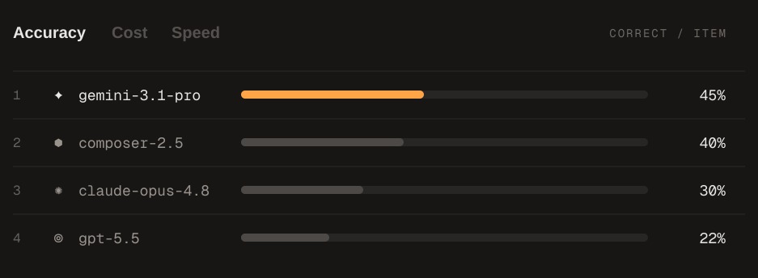
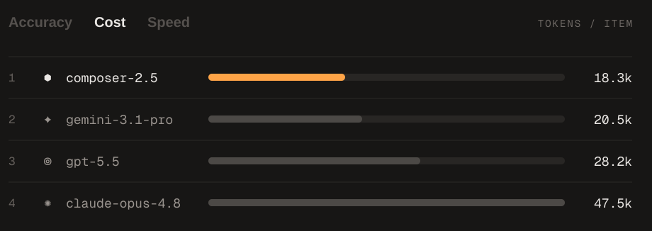
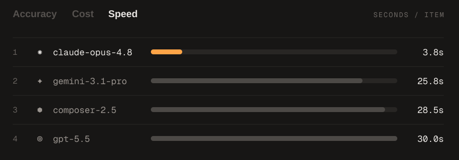

# fontbench

[fontbench](https://fontbench.laxman.me/) tests whether vision models can identify a typeface from a rendered image. Each item shows one specimen and four candidate font families; the model picks one.

## Latest run

### Accuracy



### Cost



### Speed



Results are from 60 items (three seeded runs of 20) on the private mixed dataset. Runs use the Cursor SDK, so token counts are a cost proxy rather than provider API prices. See the [live benchmark](https://fontbench.laxman.me/) for methodology and context.

## Reproduce

Requires [Bun](https://bun.sh/).

```sh
bun install
bun run dataset:all
bun run e2b:eval -- --model gemini-3.1-pro --limit 20
```

See [DATASET.md](DATASET.md) for dataset and evaluation details.
